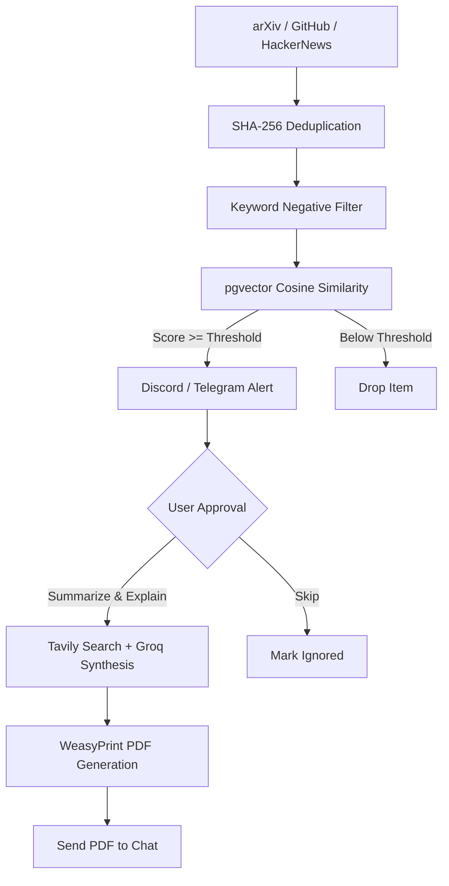

# Tech Radar Agent

[](https://www.python.org/downloads/)
[](https://fastapi.tiangolo.com)
[](https://github.com/langchain-ai/langgraph)
[](https://github.com/pgvector/pgvector)
[](https://opensource.org/licenses/MIT)

An autonomous research radar that monitors technical releases across arXiv, GitHub, and Hacker News, filters them against developer interests using pgvector, and delivers interactive digests to Telegram and Discord with 1-click PDF brief synthesis.

---

## How It Works

Instead of broadcasting every paper or repo, the agent filters candidate items through a multi-stage funnel and pauses for user approval before doing deep research.



### Pipeline Stages

1. **Ingestion & Deduplication**: Polls arXiv, GitHub trending, and Hacker News top stories. Releases are hashed with SHA-256 to ensure items are never processed or alerted twice.
2. **Deterministic Filter**: Drops releases containing user-ignored keywords (e.g., `crypto`, `nft`) with zero LLM overhead.
3. **Semantic Matching**: Computes cosine similarity between release abstracts and the user profile vector using PostgreSQL (`pgvector` with HNSW index).
4. **Human-in-the-Loop Alerts**: Sends an interactive notification with `Summarize & Explain` and `Skip` buttons to Discord or Telegram, checkpointing state in PostgreSQL.
5. **Research & PDF Synthesis**: Upon approval, the agent retrieves technical citations via Tavily, synthesizes algorithmic trade-offs using Groq LLM, compiles a styled PDF using WeasyPrint, and sends the document back to chat.

---

## Tech Stack

- **Orchestration**: LangGraph (StateGraph with human-in-the-loop interrupts & checkpointer)
- **API Framework**: FastAPI, Uvicorn
- **Database & Vector Search**: PostgreSQL 16 + `pgvector` (HNSW indexing)
- **LLM & Embeddings**: Groq (`llama-3.3-70b-versatile`), embedding generation with fallback
- **Search & Retrieval**: Tavily Search API
- **Document Engine**: WeasyPrint (HTML to PDF)
- **Bot Interfaces**: Telegram Bot API (webhook & long polling), Discord Bot API (slash commands & DMs)

---

## Quickstart

### Prerequisites

- Docker & Docker Compose
- API Keys: Telegram Bot Token (from [@BotFather](https://t.me/BotFather)) or Discord Bot Token
- Optional: Groq API key (runs deterministic fallback if omitted), Tavily API key

### 1. Configuration

```bash
cp .env.example .env
# Edit .env with your bot tokens and database settings
```

### 2. Run with Docker Compose

```bash
docker compose up --build -d
```

Services started:
- `techradar_postgres`: PostgreSQL 16 with `pgvector` on port `5432`
- `techradar_redis`: Redis on port `6379`
- `techradar_app`: FastAPI backend on port `8000`

### 3. Local Development (Without Docker)

```bash
# Create and activate virtual environment
python3.12 -m venv .venv
source .venv/bin/activate

# Install dependencies
pip install -r requirements.txt

# Start application
./run.sh
```

Check health:
```bash
curl http://localhost:8000/health
```

---

## Bot Usage

The agent can alert you on **Telegram**, **Discord**, or **both** (`PRIMARY_NOTIFICATION_CHANNEL=TELEGRAM` in `.env`).

### Telegram Commands
- `/track <domain1, domain2>` — Add topics of interest (e.g. `/track Distributed Systems, LLM Serving`)
- `/ignore <keyword1, keyword2>` — Add negative keywords to filter out noise
- `/threshold <0.0-1.0>` — Adjust cosine similarity sensitivity (default: `0.82`)
- `/profile` — View or set developer background for semantic matching
- `/scan [source] [limit]` — Trigger on-demand radar scan (e.g. `/scan arxiv 10`)
- `/research <query>` — Run one-off ad-hoc research on a specific topic
- `/status` — View current tracked domains, threshold, and config
- `/reset history` — Clear seen hashes to allow re-evaluating earlier papers

Every alert includes inline buttons:
- **📑 Summarize & Explain**: Triggers research and delivers a compiled technical PDF brief.
- **⏭️ Skip / Ignore**: Dismisses the item and closes the thread.

### Discord Slash Commands
- `/radar track domain:<name>` — Add domain to tracking footprint
- `/radar ignore keywords:<kws>` — Add negative filter keywords
- `/radar threshold value:<float>` — Update similarity cutoff
- `/radar list` — View active profile and configuration
- `!yes <thread_id>` / `!skip <thread_id>` — Approve or dismiss from DM

---

## Testing & Benchmarks

Run the full test suite (37 unit and integration tests):
```bash
./test.sh
```

Run the domain separation and grounding evaluation benchmark:
```bash
python eval/benchmark_radar.py
```

Benchmark measures:
- **Planner Taxonomy Accuracy**: Resolves natural language topics to exact arXiv categories.
- **Discovery Mode Discrimination**: Differentiates between 'latest' papers and 'foundational' surveys.
- **Domain Separation Margin**: Validates positive semantic separation between in-domain and out-of-domain literature.
- **Synthesis Grounding**: Ensures generated summaries remain grounded in source abstracts.

---

## Project Structure

```text
tech-radar-agent/
├── app/
│   ├── main.py                  # FastAPI endpoints & lifecycle
│   ├── agent/                   # LangGraph graph, nodes & state definition
│   │   ├── graph.py             # StateGraph workflow & checkpointer
│   │   └── nodes/               # Filtering, planning, research, synthesis, notification
│   ├── bot/                     # Discord & Telegram handlers
│   ├── core/                    # Config settings & database setup
│   ├── models/                  # SQLAlchemy models & Pydantic schemas
│   └── services/                # Ingestion, search, notifier, PDF compilation
├── eval/                        # Evaluation & benchmark suite
├── tests/                       # Unit & integration tests
├── docker-compose.yml           # Multi-container setup
├── Dockerfile                   # Application container definition
└── test.sh                      # Test runner script
```

---

## License

MIT License.
